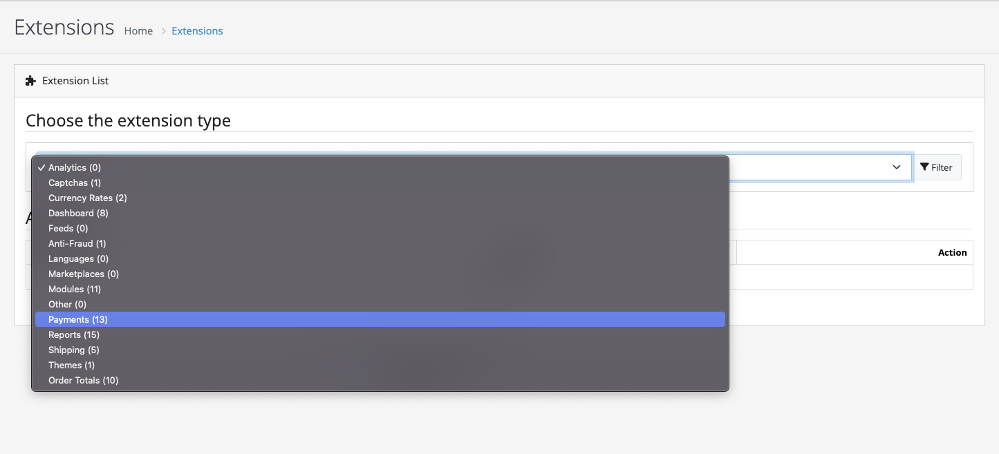
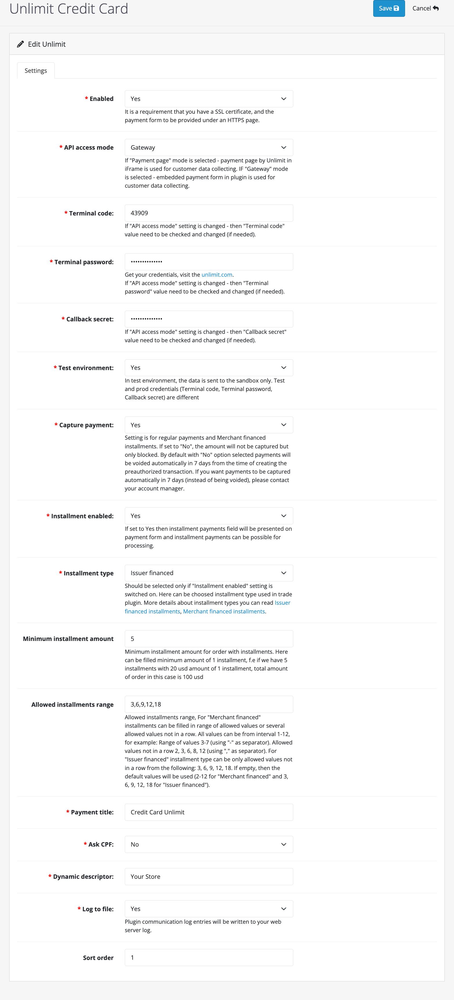
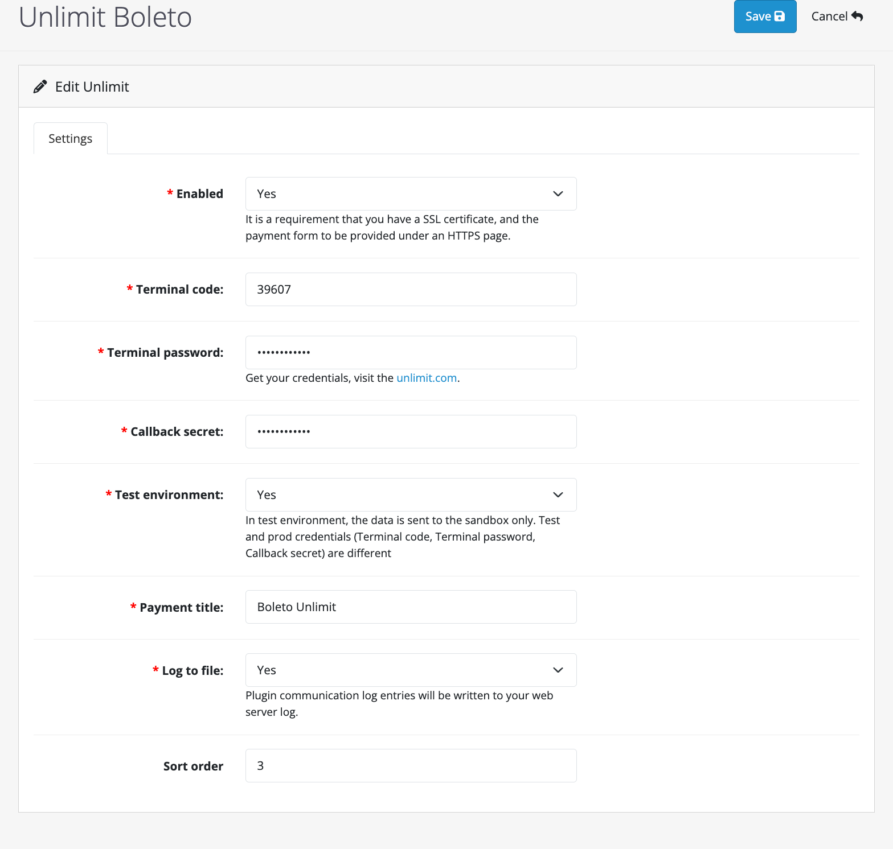
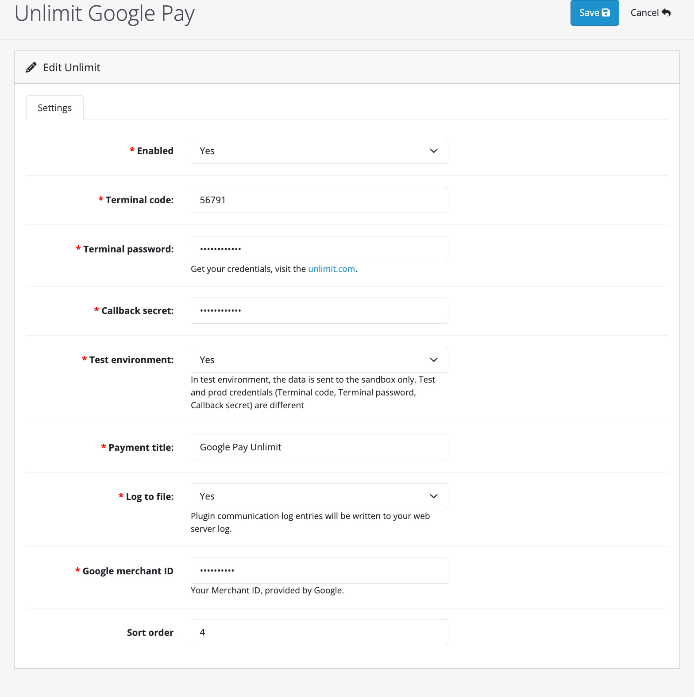
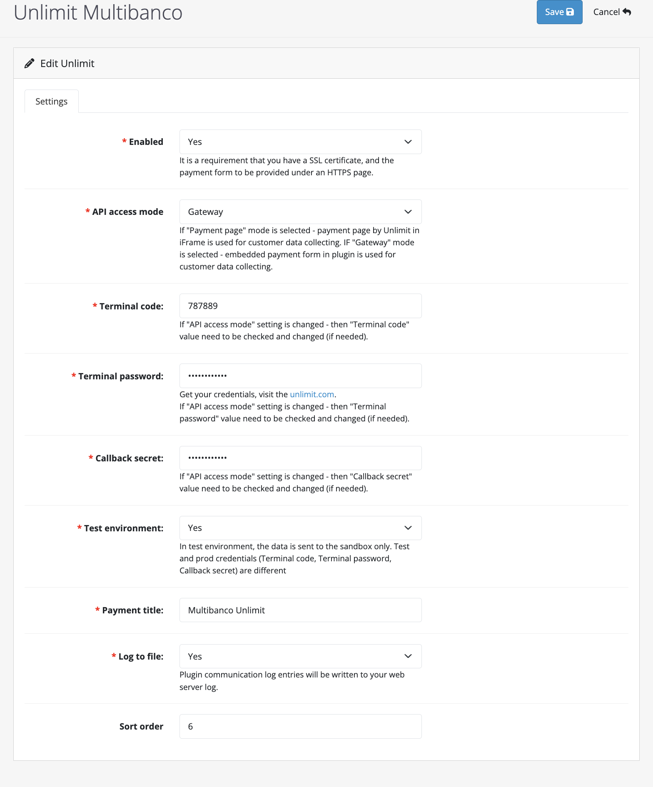
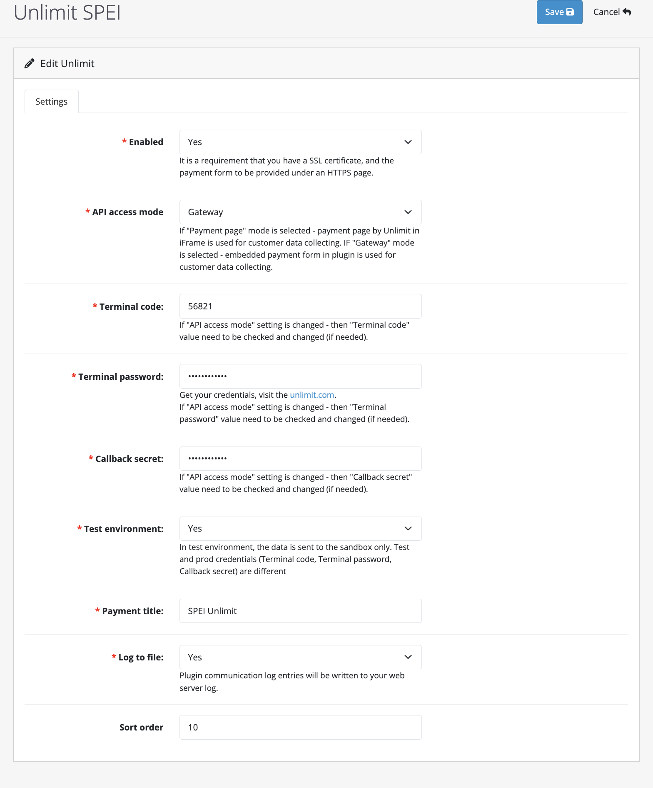

# Unlimit OpenCart Plugin Documentation

## Table of Contents
- [Overview](#overview)
- [Requirements](#requirements)
- [Supported Payment Methods](#supported-payment-methods)
- [Supported Languages](#supported-languages)
- [Installation](#installation)
- [Configuration](#configuration)
    - [Basic Settings](#basic-settings)
    - [Payment Methods Settings](#payment-methods-settings)
        - [Credit Card](#credit-card)
        - [Boleto](#boleto)
        - [Google Pay](#google-pay)
        - [MB WAY](#mb-way)
        - [Multibanco](#multibanco)
        - [PayPal](#paypal)
        - [Pix](#pix)
        - [SEPA Instant](#sepa-instant)
        - [SPEI](#spei)
    - [Payment Notification Configuration](#payment-notification-configuration)
    - [Customer Phone Number Identification](#customer-phone-number-identification)
- [Supported Post-Payment Operations](#supported-post-payment-operations)
    - [Cancellation (void) / Capture of the Payment](#cancellation-void-capture-of-the-payment)
        - [Capture of the payment](#capture-of-the-payment)
        - [Cancel (void) the payment](#cancel-void-the-payment)

## Overview
[Unlimit OpenСart](https://github.com/cardpay/opencart-plugin) plugin enables merchants to process payments, installment payments, and preauthorized payments. Additionally, the plugin supports cancellation (void), capture of regular payments, and installment payments using the OpenCart platform.

Unlimit OpenCart plugin can work in the following modes:
- Gateway mode
- Payment Page mode
  
### Requirements
**Unlimit OpenCart** plugin is open-source and supports:
- The OpenCart e-commerce platform (version 4.0.2.3)
- PHP 8 or later
- MariaDB (version 10.4 or higher)
  
### Supported Payment Methods
Supported payment methods and their capabilities are displayed in the table below:

|**Payment method**|**Payment**|**Installment**|**Void/Cancel**|
| :- | :- | :- | :- |
|Credit card |Yes|Yes|Yes|
|Boleto|Yes|No|No|
|Google Pay|Yes|No|No|
|MB WAY|Yes|No|No|
|Multibanco|Yes|No|No|
|PayPal|Yes|No|No|
|Pix|Yes|No|No|
|SEPA Instant|Yes|No|No|
|SPEI|Yes|No|No|

### Supported Languages
Supported languages:
- English (EN)
- Portuguese (PT)
- Spanish (ES)
  
## Installation
Installation process explains how to install the OpenCart plugin:
1. Download the latest version of OpenCart plugin from Unlimit's GitHub [repository](https://github.com/cardpay/opencart-plugin).
2. Go to the required root directory.
3. Upload the plugin folder to the root directory. As a result, the required plugin directory should be presented.
4. Open Extension Installer > Installer tab and installation of OpenCart plugin can be done by clicking on the Upload button.
   ****
   **Unlimit OpenCart** plugin was successfully installed and enabled.
   
## Configuration
This process explains how to set up and configure the **OpenCart plugin** to accept payments via supported payment methods.

### Basic Settings
Begin with the following basic settings:
1. Log in to Admin panel of the **OpenCart plugin** (using admin credentials).
2. Navigate to **Extensions** > **Extensions** > **Payments** (payment methods settings).
   ****
3. To enable payment methods in the **OpenCart** plugin:
    1. Credit card
    2. Boleto
    3. Google Pay
    4. MB WAY
    5. Multibanco
    6. PayPal
    7. Pix
    8. SEPA Instant
    9. SPEI

First, access the methods you want to enable via Unlimit support (it's a part of merchant onboarding process - see [here](https://www.unlimit.com/integration/)).

### Payment methods settings

#### Credit Card
To enable payments via Credit Card complete the following steps:
1. Open the payment method settings by clicking on **Action** > **Edit**.
   ****
2. Configure settings of the Credit card payment method:
- Set **Enabled** to **Yes** (by default it's disabled).
- **API access mode:**
    - Set to **Payment page** for cases when the payment page by Unlimit in iFrame is used for customer data collecting.
    - Set to **Gateway** for cases when embedded payment form in plugin is used for customer data collecting.
- Set **Terminal code**, **Terminal password**, **Callback secret** values - it should be merchant credentials in Unlimit APIv3 for this payment method (how to obtain credentials see [here](https://www.unlimit.com/integration/)).
- **Test environment:**
    - Set to **Yes** for Sandbox environment (for test purposes).
    - Set to **No** for Production environment.
- **Capture payment:**
    - Set to **Yes** - for completing payment automatically (one-phase payment).
    - Set to **No** - for two-phases of payment: the amount will not be captured but only blocked.
- **Installment enabled:** - this setting enables installment payments:
    - Set to **Yes** - installment payments are enabled.
    - Set to **No** - installment payments aren't enabled.
- **Installment type:** - installment type used in plugin:
    - Set to **Issuer financed** - for using Issuer financed installments - for more details about it, see [API documentation](https://integration.unlimit.com/doc-guides/yjri881uncqhc-overview#issuer-financed-if).
    - Set to **Merchant financed** - for using Merchant financed installments - for more details about it, see [API documentation](https://integration.unlimit.com/doc-guides/yjri881uncqhc-overview#merchant-financed-mf_hold).
- **Minimum installment amount:** - minimum amount of 1 installment.
- **Allowed installments range:** - allowed installments range:
    - 1-12 for Merchant financed.
    - 3, 6, 9, 12, 18 for Issuer financed.
- **Payment title** - fill in the name of the payment method, which will be presented for the customer in checkout.
- **Ask CPF** - set to **Yes** if you require **CPF (Brazilian Tax Id)** of your customers during checkout.
- **Dynamic descriptor** - in this setting is described dynamic\_descriptor parameter in payment request - for more details about it, see [API documentation](https://integration.unlimit.com/api-reference/b5e0a98548e2b-payment-request-payment-data).
- **Log to File** - the setting determines whether plugin communication logs can be written to your web server log.
  
#### Boleto
To enable payments via Boleto complete the following steps:
1. Open the payment method settings by clicking on **Action** > **Edit**.
   ****
2. Configure settings of the Boleto  payment method:
- Set **Enabled** to **Yes** (by default it's disabled).
- Set **Terminal code**, **Terminal password**, and **Callback secret** values - For this payment method, it should be merchant credentials in Unlimit API v3 (how to obtain credentials - see [here](https://www.unlimit.com/integration/)).
- **Test environment**:
    - Set to **Yes** for Sandbox environment (for test purposes).
    - Set to **No** for Production environment.
- **Payment title** - Fill in the name of the payment method, will be presented for the customer in checkout.
- **Log to file** - the setting determines whether plugin communication logs can be written to your web server log.
  
#### Google Pay
To enable payments via Google Pay complete the following steps:
1. Open the payment method settings by clicking on **Action** > **Edit**.
   ****
3. Configure settings of the Google Pay  payment method:
- Set **Enabled** to **Yes** (by default it's disabled).
- Set **Terminal code**, **Terminal password**, and **Callback secret** values - For this payment method, it should be merchant credentials in Unlimit API v3 (how to obtain credentials - see [here](https://www.unlimit.com/integration/)).
- **Test environment**:
    - Set to **Yes** for Sandbox environment (for test purposes).
    - Set to **No** for Production environment.
- **Payment title** - Fill in the name of the payment method, will be presented for the customer in checkout.
- **Log to file** - the setting determines whether plugin communication logs can be written to your web server log.
- **Google merchant ID** - Merchant ID, provided by Google.

#### MB WAY
To enable payments via MB WAY complete the following steps:
1. Open the payment method settings by clicking on **Action** > **Edit**.
   ****
2. Configure settings of the MB WAY  payment method:
- Set **Enabled** to **Yes** (by default it's disabled).
- **API access mode:**
    - Set to **Payment page** for cases when payment page by Unlimit in iFrame is used for customer data collecting.
    - Set to **Gateway** for cases when embedded payment form in plugin is used for customer data collecting.
- Set **Terminal code**, **Terminal password**, and **Callback secret** values - For this payment method, it should be merchant credentials in Unlimit APIv3 (how to obtain credentials - see [here](https://www.unlimit.com/integration/))
- **Test environment:**
    - Set to **Yes** for Sandbox environment (for test purposes).
    - Set to **No** for Production environment.
- **Payment title** - Fill in the name of the payment method, which will be presented for the customer in checkout.
- **Log to file** - the setting determines whether plugin communication logs can be written to your web server log.  
  
#### Multibanco
To enable payments via Multibanco complete the following steps:
1. Open the payment method settings by clicking on **Action** > **Edit**.
   ****
1. Configure settings of the Multibanco payment method:
- Set **Enabled** to **Yes** (by default it's disabled).
- **API access mode:**
    - Set to **Payment page** for cases when payment page by Unlimit in iFrame is used for customer data collecting.
    - Set to **Gateway** for cases when embedded payment form in plugin is used for customer data collecting.
- Set **Terminal code**, **Terminal password**, and **Callback secret** values - For this payment method, it should be merchant credentials in Unlimit APIv3 (how to obtain credentials - see [here](https://www.unlimit.com/integration/))
- **Test environment:**
    - Set to **Yes** for Sandbox environment (for test purposes).
    - Set to **No** for Production environment.
- **Payment title** - Fill in the name of the payment method, which will be presented for the customer in checkout.
- **Log to file** - the setting determines whether plugin communication logs can be written to your web server log.
  
#### PayPal
To enable payments via PayPal complete the following steps:
1. Open the payment method settings by clicking on **Action** > **Edit**.
   ****
2. Configure settings of the PayPal payment method:
- Set **Enabled** to **Yes** (by default it's disabled).
- **API access mode:**
    - Set to **Payment page** for cases when payment page by Unlimit in iFrame is used for customer data collecting.
    - Set to **Gateway** for cases when embedded payment form in plugin is used for customer data collecting.
- Set **Terminal code**, **Terminal password**, and **Callback secret** values - For this payment method, it should be merchant credentials in Unlimit APIv3 (how to obtain credentials - see [here](https://www.unlimit.com/integration/))
- **Test environment:**
    - Set to **Yes** for Sandbox environment (for test purposes).
    - Set to **No** for Production environment.
- **Payment title** - Fill in the name of the payment method, which will be presented for the customer in checkout.
- **Log to file** - the setting determines whether plugin communication logs can be written to your web server log.
  
#### Pix
To enable payments via Pix complete the following steps:
1. Open the payment method settings by clicking on **Action** > **Edit**.
   ****
2. Configure settings of the Pix payment method
- Set **Enabled** to **Yes** (by default it's disabled).
- Set **Terminal code**, **Terminal password**, and **Callback secret** values - For this payment method, it should be merchant credentials in Unlimit APIv3 (how to obtain credentials - see [here](https://www.unlimit.com/integration/))
- **Test environment:**
    - Set to **Yes** for Sandbox environment (for test purposes).
    - Set to **No** for Production environment.
- **Payment title** - Fill in the name of the payment method, which will be presented for the customer in checkout.
- **Log to file** - the setting determines whether plugin communication logs can be written to your web server log.
  
#### SEPA Instant
To enable payments via SEPA Instant complete the following steps:
1. Open the payment method settings by clicking on **Action** > **Edit**.
   ****
2. Configure settings of the SEPA Instant payment method:
- Set **Enabled** to **Yes** (by default it's disabled).
- **API access mode:**
    - Set to **Payment page** for cases when payment page by Unlimit in iFrame is used for customer data collecting.
    - Set to **Gateway** for cases when embedded payment form in plugin is used for customer data collecting.
- Set **Terminal code**, **Terminal password**, and **Callback secret** values - For this payment method, it should be merchant credentials in Unlimit APIv3 (how to obtain credentials - see [here](https://www.unlimit.com/integration/))
- **Test environment:**
    - Set to **Yes** for Sandbox environment (for test purposes).
    - Set to **No** for Production environment.
- **Payment title** - Fill in the name of the payment method, which will be presented for the customer in checkout.
- **Log to file** - the setting determines whether plugin communication logs can be written to your web server log.
  
#### SPEI
To enable payments via SPEI complete the following steps:

1. Open the payment method settings by clicking on **Action** > **Edit**.
   ****
2. Configure settings of the SPEI payment method:
- Set **Enabled** to **Yes** (by default it's disabled).
- **API access mode:**
    - Set to **Payment page** for cases when payment page by Unlimit in iFrame is used for customer data collecting.
    - Set to **Gateway** for cases when embedded payment form in plugin is used for customer data collecting.
- Set **Terminal code**, **Terminal password**, and **Callback secret** values - For this payment method, it should be merchant credentials in Unlimit APIv3 (how to obtain credentials - see [here](https://www.unlimit.com/integration/))
- **Test environment:**
    - Set to **Yes** for Sandbox environment (for test purposes).
    - Set to **No** for Production environment.
- **Payment title** - Fill in the name of the payment method, which will be presented for the customer in checkout.
- **Log to file** - the setting determines whether plugin communication logs can be written to your web server log.
  
### Payment notification configuration
This process explains how to set up Order statuses for payment notifications:

1. Log in to the Unlimit’s [Merchant account](https://sandbox.cardpay.com/ma) with Merchant credentials (obtaining of merchant credentials is a part of merchant onboarding process - see details [here](https://www.unlimit.com/integration/)).
1. Go to **Wallet Settings** and click on the Wallet's ID (Settings / Wallet settings / choose specific wallet id / Callbacks / JSON callback URL).
1. Fill in the JSON Callback URL field with:
   `https://<merchant\_domain>/index.phproute=extension/unlimit/payment/ul\_general/callback`where *<merchant\_domain>* is website domain.

The notification statuses have been successfully configured.

### Customer phone number identification
To make payment by all methods, the client needs to define a phone number.
- To enter the phone number, there is a field in the payment form where the client can enter the phone number.
- The client needs to enter the country code and phone number.
- After filling in all the payment fields it is necessary to press the "Pay" button. If the entered number does not correspond to the format required for the payment method, an error will be generated.
  
## Supported post-payment operations
Unlimit OpenCart plugin supports the following post-payment operations:
- Void (Cancellation)
- Capture of the Payment
  
### Cancellation (void)/ Capture of the payment
Cancellation (void) / capture of the payment only works for **Credit card** payment method.

- It's available only for orders which were processed by a certain payment method configuration (**Capture payment** is set to **No**).
- If **Capture payment** is set to **Yes**, an order will be completed without any user action in Opencard Admin Panel.
  
#### Capture of the payment

1. To capture a preauthorized payment, is needed to go to Sales > Orders and in the action column, click View for the order that is needed.
2. Edit the quantity of items if needed in the **Item** block (change the quantity of the items and **complete order partially**).
3. Then, click the **Capture** **payment** button.Capture payment button is available only if the payment status is Authorized and the order status is Processing.
   ****
4. To confirm the order capture, click OK button in the pop-up window that appears.
5. After confirming the need to capture the order, the order status will change to Complete in the Order History section.
   
#### Cancel (void) the payment

1. To cancel (void) the payment, is needed to go to Sales > Orders and in the action column, click View for the order with Processing status.
2. Click **Cancel payment button**.
   ****
4. To confirm payment cancellation, click OK button in the pop-up window that appears
5. After confirming the need to cancel the payment, the order status will change to Canceled in the Order History section.